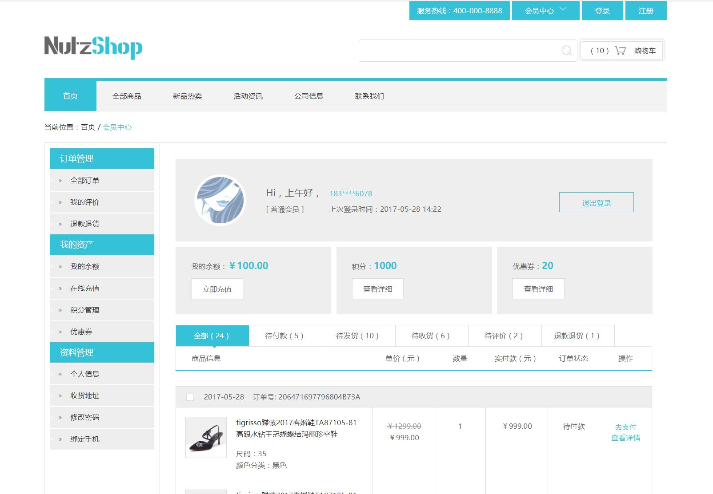
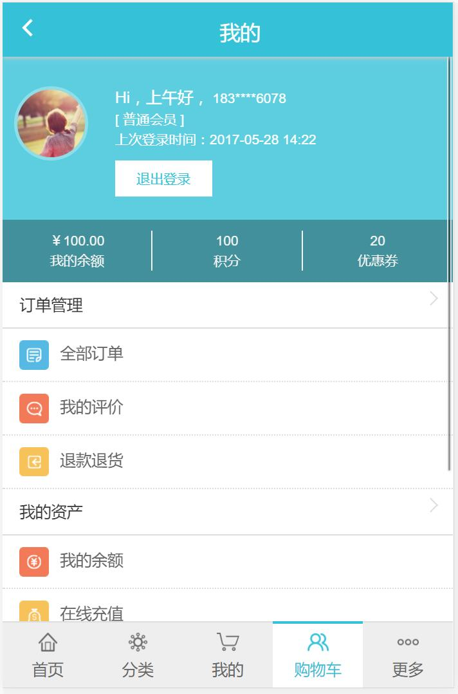

# NutzShop
基于NutzWk的开源商城系统

## 已完成

商品系统：商品规格、商品类型、商品类别、商品分类、商品发布、ES数据同步

会员系统：会员等级、会员管理、积分管理、余额管理

装修系统：资源管理、模板管理

商城配置：基本配置（ES索引管理）、快递公司、物流模板、支付配置

## 进行中

PC端前台（已完成首页、文章页、商品列表、商品搜索）、会员中心、购物车

## 待完成

订单系统：前台下订单、后台订单处理

售后系统：订单售后、投诉建议

财务系统：销售统计、财务对账

# 授权方式

Logo、图片素材、版面样式等前端页面版权归NutzShop所有（若需要可付费获取授权），其他所有代码免费开源

【认领开发任务可免费获取授权】

# 开发事项

## redis (必须启用)
用在shiro二级缓存、主键生成器、wkcache等

## elasticsearch（必须启用）
1、搜索引擎服务  https://www.elastic.co/downloads/elasticsearch    v5.4.0

2、中文分词插件  https://github.com/NLPchina/elasticsearch-analysis-ansj

./bin/elasticsearch-plugin install https://github.com/NLPchina/elasticsearch-analysis-ansj/releases/download/v5.4.0/elasticsearch-analysis-ansj-5.4.0.0-release.zip

3、ES管理客户端下载

https://github.com/farmerx/ElasticHD/releases

# 效果图

## PC

## WAP+微信

